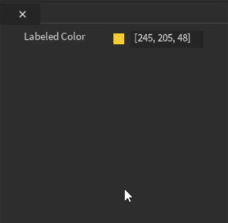

<h1 align="center">Studio Widgets</h1>

<div align="center">
    A set of GUI elements to use in Roblox Plugins hosted in PluginGUIs. Widgets have a standard "Studio" look & feel.
</div>

<div>&nbsp;</div>

## Overview
With PluginGuis, your RobloxPlugins can create GUIs hosted in dockable widgets (as opposed to being hosted in 3d viewport).

We encourage plugin developers to use this library so that your GUIs have a standardized look & feel: colors, spacing, layout, etc.

We will keep these libraries up to date as Studio look & feel changes (e.g. automatic support for Dark Theme, when that happens).

## Please contribute!
We will work hard to keep this library up to date, bug-free, etc.

That said, we have a small team and many competing priorities, so your efforts to improve this library are welcome and invited.  Feel free to fork the repository and make fixes and improvements as you see fit.  We will be happy to merge in any updates that fit within our vision of the library.

## Coding conventions
Class and function names are CamelCase, starting with caps.
Variable and member names are CamelCase, starting with lowercase.
Members and methods of classes that begin with '_' are considered "private": should not be read or written outside the class.

### Files

* [CollapsibleTitledSection.lua](#collapsibletitledsectionlua)
* [ColorPicker.lua](#colorpickerlua)
* [CustomTextButton.lua](#customtextbuttonlua)
* [DropdownMenu.lua](#dropdownmenulua)
* [GuiUtilities.lua](#guiutilitieslua)
* [HorizontalLine.lua](#horizontallinelua)
* [ImageButtonWithText.lua](#imagebuttonwithtextlua)
* [LabeledCheckbox.lua](#labeledcheckboxlua)
* [LabeledColorInputPicker.lua](#labeledcolorinputpickerlua)
* [LabeledMultiChoice.lua](#labeledmultichoicelua)
* [LabeledRadioButton.lua](#labeledradiobuttonlua)
* [LabeledSlider.lua](#labeledsliderlua)
* [LabeledTextInput.lua](#labeledtextinputlua)
* [LabeledToggleButton.lua](#labeledtogglebuttonlua)
* [RbxGui.lua](#rbxguilua)
* [StatefulImageButton.lua](#statefulimagebuttonlua)
* [VerticallyScalingListFrame.lua](#verticallyscalinglistframelua)
* [VerticalScrollingFrame.lua](#verticalscrollingframelua)
* [VerticalSpacer.lua](#verticalspacerlua)

#### CollapsibleTitledSection.lua
A "Section" containing one or more widgets, with titlebar.  Title bar includes rotating arrow component which can be used to collapse/expand the section.

Light | Dark
:-:|:-:
  |  

```Lua
local collapse = CollapsibleTitledSection.new(
    "suffix", -- name suffix of the gui object
    "titleText", -- the text displayed beside the collapsible arrow
    true, -- have the content frame auto-update its size?
    true, -- minimizable?
    false -- minimized by default?
)

-- put things we want to be "collapsed" under the frame by the :AddChild() method
local label = Instance.new("TextLabel")
label.Text = "Peekaboo!"
label.Size = UDim2.new(0, 60, 0, 20)
label.BackgroundTransparency = 1
label.BorderSizePixel = 0

collapse:AddChild(label)

-- set the parent of the collapse object by setting the parent of the frame returned by the :GetSectionFrame() method
collapse:GetSectionFrame().Parent = widgetGui
```

#### ColorPicker.lua
A simple color picker component with a Confirm and Cancel button.

```Lua
local picker = ColorPicker.new(
    "suffix" -- name suffix of gui object
)

-- fire function when color value changes
picker:SetValueChangedFunction(function(newValue: Color3)
    print("New color is", newValue)
end)

-- assign a function to run when clicking the cancel button
picker:SetCancelFunction(function ()
    print("Cancelled")
end)

-- assign a function to run when clicking the confirm button
picker:SetConfirmFunction(function (chosenColor: Color3)
    -- get the current color value and do something with it
    print("The confirmed color is", chosenColor)
end)

-- get current color value
picker:GetValue()

-- set the picker parent by getting its frame with :GetFrame() method
button:GetFrame().Parent = widgetGui
```

#### CustomTextButton.lua
A text button contained in an image (rounded rect).  Button and frame highlight appropriately on hover and click.

Light | Dark
:-:|:-:
  |  

```Lua
local button = CustomTextButton.new(
    "button", -- name of the gui object
    "labelText" -- the text displayed on the button
    false, -- should it have square corners?
)

-- set the button size
button:SetSize(UDim2.new(0, 70, 0, 25))

-- make the button disabled
button:SetDisabled(true)

-- define the function that runs when clicking the button
button:SetClickedFunction(function()
    print("I was clicked!")
end)

-- set the button parent by getting its frame with :GetFrame() method
local buttonObject = button:GetFrame()
buttonObject.Parent = widgetGui
```

#### DropdownMenu.lua
A dropdown menu component.

Light | Dark
:-:|:-:
  |  

```Lua
local choices = {
    {Id: 1, Text: "Option 1"},
    {Id: 2, Text: "Option 2"},
    {Id: 3, Text: "Option 3"},
    {Id: 4, Text: "Option 4"},
}

local dropdown = DropdownMenu.new(
    "suffix", -- name suffix of gui object
    "labelText", -- text beside the dropdown
    choices, -- the table of options
    "Select ..." -- the placeholder text, shows when nothing is selected
)

-- adds a single option to the dropdown menu.
dropdown:AddSelectionItem({Id: 5, Text: "Option 5"})

-- adds multiple options to the dropdown menu.
dropdown:AddSelectionsFromTable({
    {Id = 6, Text = "Option 6"},
    {Id = 7, Text = "Option 7"}
})

-- set manually the selected option
dropdown:SetValue(3) -- set to option of id 3
print(dropdown:GetValue()) -- prints the selected option Id
print(dropdown:GetText()) -- prints the selected option Text

-- use :GetSectionFrame() to set the parent of the DropdownMenu
checkbox:GetSectionFrame().Parent = widgetGui
```

#### GuiUtilities.lua
Grab bag of functions and definitions used by the rest of the code: colors, spacing, etc.

#### HorizontalLine.lua
A component for showing a horizontal line that spans the whole width of its parent.

```Lua
local line = HorizontalLine.new(
    "suffix", -- name suffix of gui object
    10, -- optional height
    Color3.new(1,1,1) -- optional color
)

-- use :GetFrame() to set the parent of the HorizontalLine
line:GetFrame().Parent = widgetGui
```

#### ImageButtonWithText.lua
A button comprising an image above text.  Button highlights appropriately on hover and click.


```Lua
local button = ImageButtonWithText.new(
    "imgButton", -- name of the gui object
    1,  -- sets the sorting order for use with a UIGridStyleLayout object
    "rbxassetid://924320031", -- the asset id of the image
    "text", -- button text 
    UDim2.new(0, 100, 0, 100), -- button size
    UDim2.new(0, 70, 0, 70), -- image size
    UDim2.new(0, 15, 0, 15), -- image position
    UDim2.new(0, 60, 0, 20), -- text size
    UDim2.new(0, 20, 0, 80) -- text position
)

-- define the function that runs when clicking the button
button:SetClickedFunction(function ()
    -- use the :SetSelected() method to highlight the button
    -- use the :GetSelected() method to return a boolean that defines if the button is selected or not
    button:SetSelected(not button:GetSelected())
end)

-- use the :GetButton() method to return an ImageButton gui object
local buttonObject = button:GetButton()
buttonObject.Parent = widgetGui
```

#### LabeledCheckbox.lua
A component comprising a text label and a checkbox.  Can be configured in normal or "small" sizing.  Layout and spacing change depending on size. 

Light | Dark
:-:|:-:
  |  

```Lua
local checkbox = LabeledCheckbox.new(
    "suffix", -- name suffix of gui object
    "labelText", -- text beside the checkbox
    false, -- initial value
    false -- initially disabled?
)

-- get/set current value of the checkbox
checkbox:SetValue(true)
print(checkbox:GetValue())

-- disables and forces a checkbox value
checkbox:DisableWithOverrideValue(false)
if (checkbox:GetDisabled()) then
    checkbox:SetDisabled(false)
end

-- return the label or button frames
print(checkbox:GetLabel())
print(checkbox:GetButton())

-- fire function when checkbox value changes
checkbox:SetValueChangedFunction(function(newValue)
    print(newValue);
end)

-- use :GetFrame() to set the parent of the LabeledCheckbox
checkbox:GetFrame().Parent = widgetGui
```

#### LabeledColorInputPicker.lua
A labeled color picker component.
Can be used to select colors in a color picker or manually insert the color in the RGB or HEX format.

Light | Dark
:-:|:-:
  |  

```Lua
local input = LabeledColorInputPicker.new(
    "suffix", -- name suffix of gui object
    "labelText", -- text beside the input field
    Color.new(1,1,1) -- starting color value
)

-- fire function when color value changes
input:SetValueChangedFunction(function(newValue: Color3)
    print("Chosen color was", newValue)
end)

-- manually set the input field text
input:SetValue("Hello World")
print(input:GetValue())

-- manually set what color is selected
input:SetColorValue(Color3.fromRGB(0,255,0))
print(input:GetColorValue())

-- set whether or not the color picker is enabled. if not the user can only manually type a RGB or Hex color value
input:SetPickerEnabled(false)
print(input:GetPickerEnabled())

-- use :GetFrame() to set the parent of the LabeledColorInputPicker
input:GetFrame().Parent = widgetGui
```

#### LabeledMultiChoice.lua
A component comprising a top-level label and a family of radio buttons.  Exactly one radio button is always selected.  Buttons are in a grid layout and will adjust to flood-fill parent. Height updates based on content.

Light | Dark
:-:|:-:
  |  

```Lua
-- each choice must have an Id and Text
local choices = {
    {Id = "choice1", Text = "a"},
    {Id = "choice2", Text = "b"},
    {Id = "choice3", Text = "c"}
}

local multiChoice = LabeledMultiChoice.new(
    "suffix", -- name suffix of gui object
    "labelText", -- title text of the multi choice
    choices, -- choices array
    1 -- the starting index of the selection (in this case choice 1)
)

-- get/set selection index
multiChoice:SetSelectedIndex(3) 
print(multiChoice:GetSelectedIndex())

-- fire function when index value changes
multiChoice:SetValueChangedFunction(function(newIndex)
    print(choices[newIndex].Id, choices[newIndex].Text)
end)

-- use :GetFrame() to set the parent of the LabeledMultiChoice
multiChoice:GetFrame().Parent = widgetGui
```

#### LabeledRadioButton.lua
Creates a component containing a label and a radio button

#### LabeledSlider.lua
A component comprising a label and a slider control.

Light | Dark
:-:|:-:
  |  

```Lua
-- note: the slider is clamped between [0, intervals]
local slider = LabeledSlider.new(
    "suffix", -- name suffix of gui object
    "labelText", -- title text of the multi choice
    0, -- minimum value of the slider
    100, -- maximum value of the slider
    50 -- the starting value of the slider,
    100 -- width of the slider bar component
)

-- get/set values
slider:SetValue(0)
print(slider:GetValue())

-- fire function when slider value changes
slider:SetValueChangedFunction(function(newValue)
    print(newValue)
end)

-- use :GetFrame() to set the parent of the LabeledSlider
slider:GetFrame().Parent = widgetGui
```

#### LabeledTextInput.lua
A component comprising a label and text edit control.

Light | Dark
:-:|:-:
  |  

```Lua
local input = LabeledTextInput.new(
    "suffix", -- name suffix of gui object
    "labelText", -- title text of the multi choice
    "Hello world!" -- default value
)

-- set/get graphemes which is essentially text character limit but grapemes measure things like emojis too
input:SetMaxGraphemes(20)
input:GetMaxGraphemes()

-- set/get values methods
input:SetValue("Hello world again...")
print(input:GetValue())

-- set input as read-only. while read-only the content can not be edited, only copied
input:SetReadOnly(true)
print(input:GetReadOnly())

-- fire function when input value changes
input:SetValueChangedFunction(function(newValue)
    print(newValue)
end)

-- use :GetFrame() to set the parent of the LabeledTextInput
input:GetFrame().Parent = widgetGui
```

#### LabeledToggleButton.lua
An toggle button with "on" and "off" states.

Light | Dark
:-:|:-:
  |  

```Lua
local button = LabeledToggleButton.new(
    "suffix", -- name suffix of gui object
    "labelText" -- text beside the button
)

-- fire function when the button state changes
button:SetValueChangedFunction(function(newValue: boolean)
    print(newValue)
end)

-- set as disabled. while disabled can not be toggled
button:SetDisabled(true)
print(button:GetDisabled())

-- sets the value of the button manually
button:SetValue(true)
print(button:GetValue())

-- use :GetFrame() to set the parent of the component
button:GetFrame().Parent = widgetGui
```

#### RbxGui.lua
Helper functions to support the slider control.

#### StatefulImageButton.lua
An image button with "on" and "off" states.


```Lua
local button = StatefulImageButton.new(
    "imgButton", -- name of the gui object
    "rbxassetid://924320031", -- image asset id
    UDim2.new(0, 100, 0, 100) -- size of the button
)

-- set if the StatefulImageButton is selected or not
local selected = false
button:setSelected(selected)

-- define the function that runs when clicking the button
button:SetClickedFunction(function ()
    selected = not selected
    button:setSelected(selected)
end)

-- use the :getButton() method to return the ImageButton gui object
local buttonObject = button:getButton()
buttonObject.Parent = widgetGui
```

#### VerticallyScalingListFrame.lua
A frame that contains a list of sub-widgets.  Will grow to accomodate size of children.

```Lua
local listFrame = VerticallyScalingListFrame.new(
    "suffix" -- name suffix of gui object
)

local label = Instance.new("TextLabel")
label.Text = "labelText"
label.Size = UDim2.new(0, 60, 0, 20)
label.BackgroundTransparency = 1
label.BorderSizePixel = 0
local label2 = label:Clone()
local label3 = label:Clone()

-- fire function when the listFrame resizes
listFrame:SetCallbackOnResize(function()
    print("Frame was resized!")
end)

-- add a gui element to the VerticallyScalingListFrame
listFrame:AddChild(label)
listFrame:AddChild(label2)
listFrame:AddChild(label3)

-- add padding to the VerticallyScalingListFrame
listFrame:AddBottomPadding()

-- use :GetFrame() to set the parent of the VerticallyScalingListFrame
listFrame:GetFrame().Parent = widgetGui
```

#### VerticalScrollingFrame.lua
A frame that holds sub-widgets and gives the user the ability to scroll through them over a fixed space.


```Lua
local choices = {
    {Id = "choice1", Text = "a"},
    {Id = "choice2", Text = "b"},
    {Id = "choice3", Text = "c"}
}

local scrollFrame = VerticalScrollingFrame.new("suffix")

local listFrame = VerticallyScalingListFrame.new("suffix")
local collapse = CollapsibleTitledSection.new("suffix", "titleText", true, true, true)
local multiChoice = LabeledMultiChoice.new("suffix", "labelText", choices, 1)
local multiChoice2 = LabeledMultiChoice.new("suffix", "labelText", choices, 2)

collapse:AddChild(multiChoice:GetFrame())
collapse:AddChild(multiChoice2:GetFrame())

listFrame:AddChild(collapse:GetSectionFrame()) -- add child to expanding VerticallyScalingListFrame

local collapse = CollapsibleTitledSection.new("suffix", "titleText", true, false, false)
local multiChoice = LabeledMultiChoice.new("suffix", "labelText", choices, 1)
local multiChoice2 = LabeledMultiChoice.new("suffix", "labelText", choices, 2)

collapse:AddChild(multiChoice:GetFrame())
collapse:AddChild(multiChoice2:GetFrame())

listFrame:AddChild(collapse:GetSectionFrame()) -- add child to expanding VerticallyScalingListFrame

listFrame:AddBottomPadding() -- add padding to VerticallyScalingListFrame

scrollFrame:AddChild(listFrame:GetFrame()) -- scroll content will be the VerticallyScalingListFrame
scrollFrame:GetSectionFrame().Parent = widgetGui -- set the section parent
```

#### VerticalSpacer.lua
A component for showing an empty space that spans the whole width of its parent.

```Lua
local space = VerticalSpacer.new(
    "suffix", -- name suffix of gui object
    10, -- optional height
)

-- use :GetFrame() to set the parent of the VerticalSpacer
space:GetFrame().Parent = widgetGui
```

### Bringing the project into studio
The easiest way to bring the project into studio is to use the [HttpService](https://www.robloxdev.com/api-reference/class/HttpService) to pull the contents directly from this github project into module scripts. After enabling the http service from `Game Settings` the following code can be run in the command bar.

```Lua
local HttpService = game:GetService("HttpService")
local Branch = "master"

local function FetchFiles(url, parent)
    local response = HttpService:GetAsync(url .. "?ref=" .. Branch)
    for _, file in ipairs(HttpService:JSONDecode(response)) do
        if file.type == "file" and file.name:sub(-4) == ".lua" then
            local moduleName = file.name:sub(1, -5)
            local source = HttpService:GetAsync(file.download_url)
            local moduleScript = Instance.new("ModuleScript")
            moduleScript.Name = moduleName
            moduleScript.Source = source
            moduleScript.Parent = parent
        end
    end
end

local studioWidgetsFolder = Instance.new("Folder")
studioWidgetsFolder.Name = "StudioWidgets"
studioWidgetsFolder.Parent = workspace

local componentsFolder = Instance.new("Folder")
componentsFolder.Name = "Components"
componentsFolder.Parent = studioWidgetsFolder

FetchFiles("https://api.github.com/repos/RenanMsV/StudioWidgets/contents/src", studioWidgetsFolder)
FetchFiles("https://api.github.com/repos/RenanMsV/StudioWidgets/contents/src/Components", componentsFolder)

print("Modules downloaded")
```

## License
Available under the Apache 2.0 license. See [LICENSE](LICENSE) for details.
